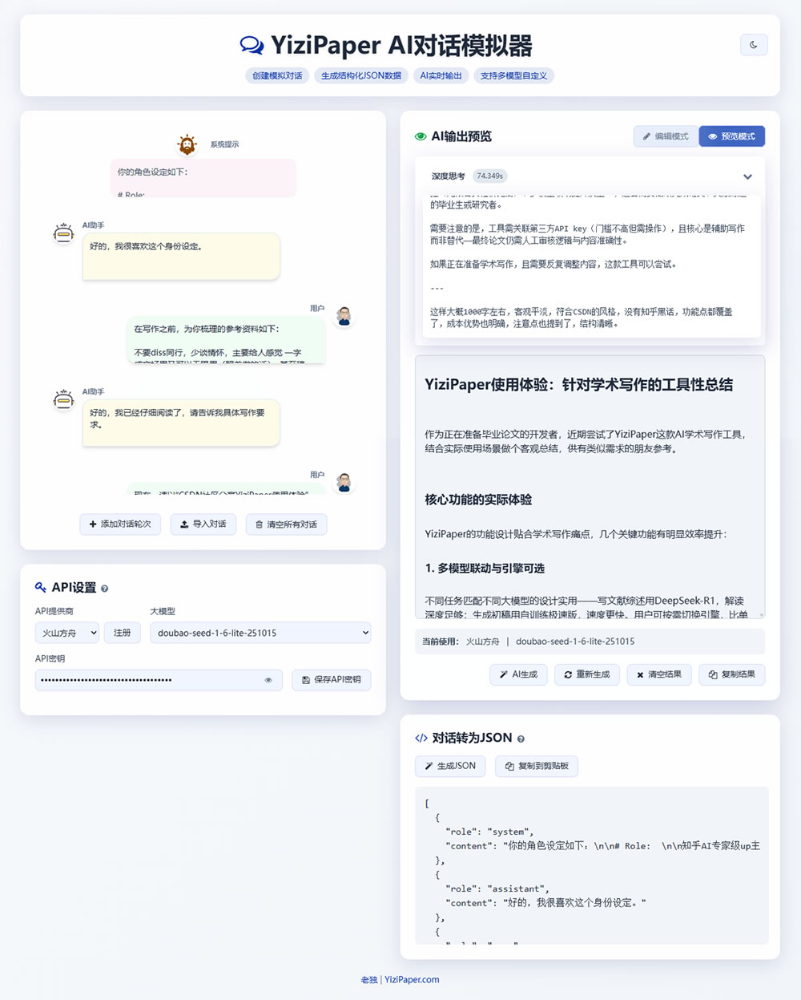

# YiziPaper-AI-Dialog-Builder
AI 写作开发者专属对话测试工具 | 支持多模型 / 多 Prompt / 多上下文组合调试，纯 HTML+JS 本地运行，无需注册、无云依赖、完全开源，数据安全可控。AI 辅助编程开发，让 AI 写作测试更简单高效 📝

## 为什么会有这么个模拟器？
作为一名AI写作开发者，我需要频繁测试不同模型、不同prompt以及不同上下文组合的AI写作效果。市面上的工具要么功能单一，要么操作繁琐，始终找不到趁手的测试工具。

于是我决定用AI辅助编程（AI Coding）手搓一个：从需求分析到代码实现，全程与AI协作完成。这个小工具的最大特色是：基于纯HTML+JS本地运行，无需注册、无需云服务、完全开源，数据安全可控。

希望它能成为AI写作开发者的得力助手，让测试和调试变得更简单高效。

## 主要功能
- 支持多轮对话编辑，包括用户、AI助手和系统角色
- 支持多种AI模型提供商：火山方舟、阿里云百炼、OpenAI、Anthropic、Google Gemini
- 支持深度思考（思维链）显示
- 支持对话JSON导入导出
- 支持编辑模式和预览模式切换
- 支持深色/浅色主题切换
- 支持API密钥本地安全存储

## 使用方法
1. 在左侧编辑区添加或修改对话内容
2. 点击"添加对话轮次"按钮添加用户和AI对话各一条
3. 点击头像切换角色（用户/AI助手/系统）
4. 点击删除按钮删除对话[无法撤销]
5. 点击对话内容，自动展开文本框，编辑对话内容
6. 点击"导入对话"按钮，可以导入已有Json格式对话列表[覆盖当前对话]
7. 在API设置中选择AI模型提供商和具体模型
   - 如需增删厂商/大模型列表，请在外挂文件`modle-config.js`中修改
8. 输入API密钥并保存设置
   - API密钥信息，不提供云存储，仅会存储在本地浏览器缓存中
9. 点击"AI生成"按钮生成AI回复
10. 在右侧预览区查看生成结果
11. 使用"生成JSON"按钮导出当前对话列表为JSON格式

## 更新日志
### v1.0.0 (2025-11-30)
- 初始版本发布
- 支持多轮对话编辑
- 支持多种AI模型提供商
- 支持深度思考显示
- 支持对话JSON导入导出
- 支持深色/浅色主题切换
